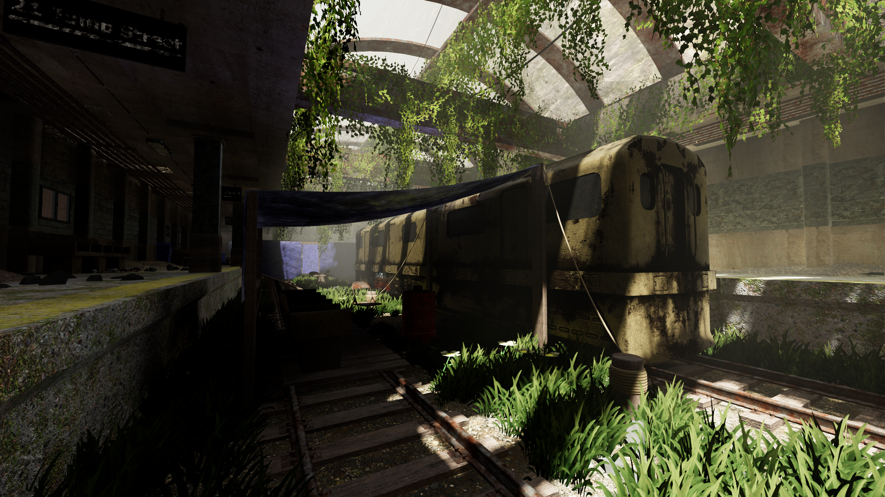
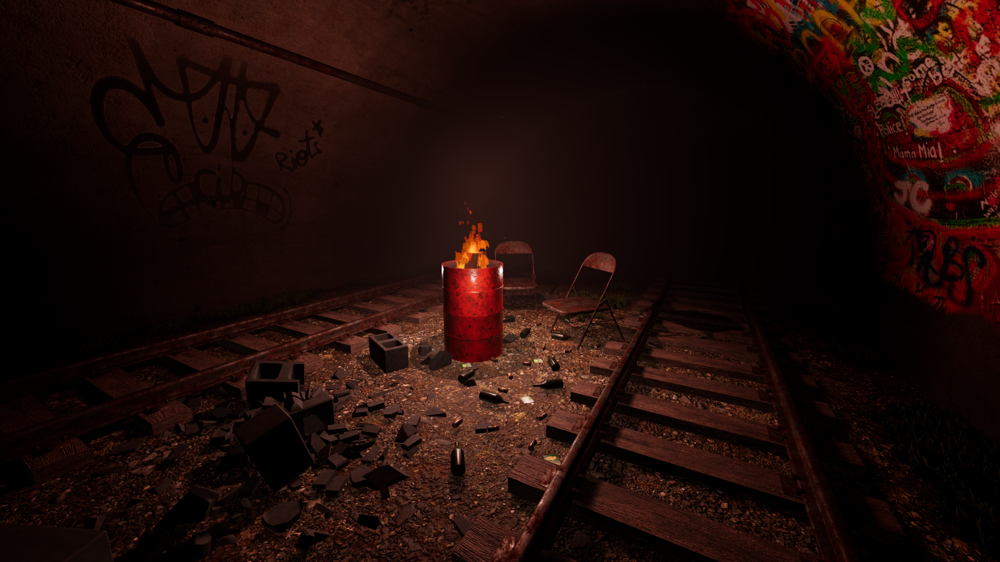
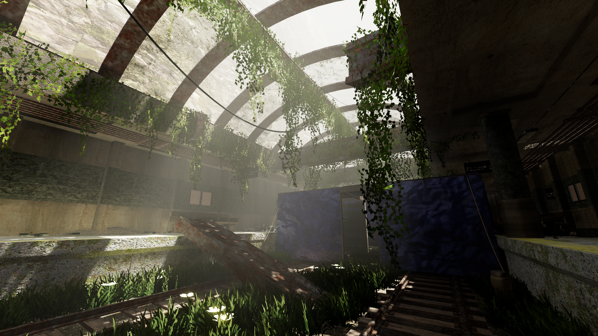

# Godot-4-Overgrown-Subway-Demo-Tweaked
Godot 4 Demo Scene of an overgrown subway inhabited by squatters, with some tweaked settings. The original project can be found [here](https://github.com/mikatomik/Godot-4-Overgrown-Subway-Demo).

## How to use:
1. This project uses .blend files for scenes. This means you need to have blend file support enabled before you open the project. [Here's how.](https://docs.godotengine.org/en/stable/tutorials/assets_pipeline/importing_scenes.html)
2. Download the zip/clone the repo. If you download the zip, extract the contents where you want the project to be.
3. Open the project.godot file with Godot 4.0
4. Run the default scene. (subway.tscn)
5. WASD for movement, shift to sprint, space to jump, F for flashlight, ESC for menu.
6. Gamepad is also supported. Left stick to move, L3 to sprint, A/X to jump, right stick to look, pause to open menu, UP on D-Pad for Flashlight.

## Features:
1. Uses SDFGI.
2. Uses Volumetric Fog
3. Buttons and sliders in game menu for enabling SSIL, SDFGI, Glow. Also has input sensitivity controls and volume controls.
4. Uses Decal nodes introduced with Godot 4.
5. Uses AudioStreamPlayer3D nodes for sound effects.
6. Uses Blend File workflow, Blend files included.

## Tweaks from original:
1. Enabled anisotropic filtering.
2. Disabled SSAO.
3. Switched Glow blend mode to Screen.
4. Switched antialiasing to TAA.
5. Switched project Stretch Mode to Disabled and Stretch Aspect to Keep.
6. Switched ambient lighting and reflections to SDFGI.

## Reasons for tweaks:
1. Anisotropic filtering preserves texture detail at oblique angles. Without it, even high quality textures end up having their quality obliterated when you're not looking at the surface head on.
2. SSAO is unnecessary when SSIL is enabled - SSIL already does SSAO's job.
3. Glow is Godot's term for Bloom. Any blend mode other than Screen is physically incorrect, and robs the image of a lot of "pop", this is especially true when using a contrasty tone mapper like ACES.
4. The project used MSAA + FXAA by default. Normally this is actually a fantastic option, especially if you don't want to deal with TAA's myriad of headaches. However, Godot's FXAA implementation is kinda bad and smeary, and Godot's TAA implementation is suprisingly sharp and not so artifacty.
5. The project's Stretch settings led to it not rendering at native resolution when you maximized the window or ran it fullscreen.
6. The project used baked lightmaps + baked reflection probes by default. Normally, this actually provides the highest quality, but Godot's reflection probes have unfortunately been [broken since forever](https://github.com/godotengine/godot-proposals/issues/3013) and are utterly leaky - you can see this in the original project when looking at the beds indoors - the sky completely leaks through the reflections. SDFGI's reflections are great, but unfortunately it means I had to switch ambient lighting to SDFGI as well.

## Included plugins and assets:
[SimpleGrass](https://github.com/IcterusGames/SimpleGrassTextured) by IcterusGames (MIT)

Ivy Assets by Perfoon from the [Abandoned Space Ship Demo](https://github.com/perfoon/Abandoned-Spaceship-Godot-Demo) (Big thanks for the inspiration, by the way!) (Non-Commercial CC)

All sounds from [Chosic](https://www.chosic.com/)  (CC0 1.0)

Several ground, concrete, metal etc textures from [AmbientCG](https://ambientcg.com/) (CC0 1.0)

All assets not covered above are available under MIT.
